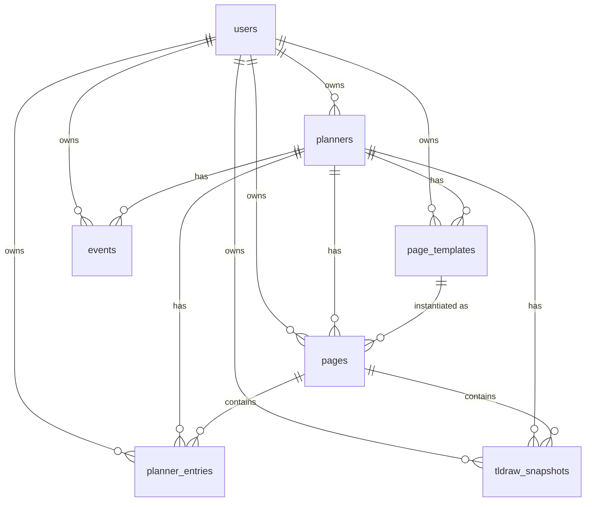

# agenda_rust — Structure & Design

A Rust port of the **agenda** planner backend (originally Rails, with a Go port alongside it).
It serves a React frontend that renders paper-planner-style pages (weekly/monthly spreads) with
rich-text day entries (TipTap) and freehand drawing layers (tldraw).

The same Rust core is shipped two ways:

1. **HTTP API server** built on [Loco](https://loco.rs) (a Rails-flavoured framework over axum + SeaORM).
2. **In-process desktop backend** embedded in a Tauri 2 app, where the frontend talks to Rust through
   a single JSON "command" IPC instead of HTTP.

The frontend is *not* in this repo. It lives in the sibling monorepo at `../agenda/apps/frontend`
(React + Vite, Easyblocks, TipTap, tldraw, TanStack Router, Redux-Saga, Capacitor for mobile). The
Tauri config points at that directory for both the dev server and the production bundle.

---

## 1. Workspace layout

Cargo workspace with three crates:

| Crate | Path | Role |
|---|---|---|
| `agenda_rust` | `/` | Library (`src/lib.rs`) + binaries. All domain logic lives here. |
| `migration` | `/migration` | SeaORM migrations, registered in `migration/src/lib.rs`. Also run by the Tauri app at startup. |
| `agenda_app` | `/src-tauri` | Tauri 2 desktop shell. Depends on `agenda_rust` and `migration` directly (no sidecar process). |

```
agenda_rust/
├── Cargo.toml                 workspace root; default-run = agenda_rust-cli
├── .cargo/config.toml         `cargo loco` alias; rust-lld linker on Windows
├── config/                    Loco YAML config per environment (development/test/production)
├── migration/src/             one file per table, timestamp-prefixed
├── src/
│   ├── lib.rs                 module root
│   ├── app.rs                 Loco `Hooks` impl: routes, workers, seed/truncate
│   ├── ipc.rs                 JSON command dispatcher shared by Tauri + stdin IPC binary
│   ├── bin/
│   │   ├── main.rs            `agenda_rust-cli` — Loco CLI (start / db / generate / ...)
│   │   ├── tool.rs            identical to main.rs (Loco convention)
│   │   ├── ipc.rs             stdin/stdout line-JSON server over `ipc::handle_command_json`
│   │   ├── db_inspect.rs      dev utility: dump sqlite_master / PRAGMA info
│   │   ├── fk_try_insert.rs   dev utility: FK smoke test (stale — uses binary UUIDs)
│   │   └── uuid_fix.rs        dev utility: text→BLOB UUID converter (obsolete after string-UUID switch)
│   ├── controllers/           axum handlers + route tables, one per resource
│   ├── models/
│   │   ├── _entities/         SeaORM codegen output — do not hand-edit, regenerate
│   │   └── *.rs               hand-written behaviour per entity (validation, finders, domain logic)
│   ├── tasks/calendar.rs      holidays + moon-phase helpers (pure functions)
│   ├── views/auth.rs          response DTOs for auth
│   ├── mailers/auth*          welcome / forgot / magic-link email templates (Tera)
│   ├── workers/downloader.rs  background-worker stub from the starter
│   ├── fixtures/users.yaml    seed data (stale: integer ids)
│   └── data/, initializers/   empty placeholders
├── src-tauri/
│   ├── src/main.rs            opens SQLite, runs migrations, exposes `ipc_command`
│   ├── tauri.conf.json        window, CSP, frontend paths, bundled resources
│   └── binaries/              Artichoke Ruby (airb, tauri_server) — unreferenced leftover
├── tests/                     Loco integration tests (models/, requests/) with insta snapshots
├── examples/playground.rs     Loco scratch entry point
├── *.sqlite / *.sqlite3       dev/test DBs (gitignored); agenda_development.sqlite3 is the legacy Rails DB
└── database_dump.sql          SQL dump of the Rails DB used for data migration
```

Roughly 4k lines of Rust in total.

---

## 2. Runtime architecture

```
                 ┌─────────────────────────────────────────────┐
                 │  React frontend  (../agenda/apps/frontend)  │
                 └───────────────┬──────────────┬──────────────┘
                                 │ HTTP /api/…  │ invoke("ipc_command", {command})
                                 ▼              ▼
            ┌────────────────────────┐   ┌────────────────────────────┐
            │  Loco / axum server    │   │  Tauri app (src-tauri)     │
            │  bin: agenda_rust-cli  │   │  #[tauri::command]         │
            │  src/app.rs routes     │   │  ipc_command(String)       │
            │  src/controllers/*     │   └──────────────┬─────────────┘
            └───────────┬────────────┘                  │
                        │                               ▼
                        │                 ┌────────────────────────────┐
                        │                 │ src/ipc.rs                 │
                        │                 │ handle_command_json(db, s) │◄── bin/ipc.rs (stdin lines)
                        │                 │ match cmd.command { … }    │
                        │                 └──────────────┬─────────────┘
                        ▼                                ▼
            ┌───────────────────────────────────────────────────────────┐
            │  src/models/*  (SeaORM)  —  find_or_build_monthly/weekly   │
            │  src/tasks/calendar.rs   —  holidays, moon phases          │
            └───────────────────────────────┬───────────────────────────┘
                                            ▼
                                   SQLite (sea-orm / sqlx)
                              migrations auto-run on boot
```

### 2a. HTTP path (Loco)

- `src/bin/main.rs` hands off to `loco_rs::cli::main::<App, Migrator>()`.
- `src/app.rs` implements Loco's `Hooks`: registers the controller route tables, the `DownloadWorker`,
  and seed/truncate for tests. `AppRoutes::with_default_routes()` adds Loco's `/_ping` and `/_health`.
- Config comes from `config/{development,test,production}.yaml` (selected by `LOCO_ENV`). The DB URI
  defaults to `sqlite://agenda_rust_development.sqlite?mode=rwc` with `auto_migrate: true`.
- Controllers are thin: each has a `Params` DTO with an `update(&mut ActiveModel)` helper, standard
  CRUD handlers, and a `routes()` fn with an `api/<resource>/` prefix.

### 2b. Desktop path (Tauri)

- `src-tauri/src/main.rs` resolves the DB URL at startup: the `AGENDA_RUST_DB_URL` env var wins
  (accepts a raw path or a `sqlite:` DSN); otherwise it creates `agenda.sqlite` in the OS
  app-local-data directory. It connects with SeaORM, runs `Migrator::up`, and stores the
  connection in a `static OnceCell`.
- A single Tauri command `ipc_command(command: String)` forwards the raw JSON string to
  `agenda_rust::ipc::handle_command_json` and returns the serialized `OutgoingResponse`.
- `tauri.conf.json` bundles `../agenda_rust_development.sqlite` as a resource and sets a CSP that
  allows tldraw's CDN and Google Fonts.

### 2c. IPC protocol (`src/ipc.rs`)

Request / response envelope, independent of transport:

```json
{ "command": "pages_index", "payload": { "planner_id": "…", "week_id": "41_2025_l" } }
{ "success": true, "data": { … } }
{ "success": false, "error": "…" }
```

| Command | Payload | Delegates to |
|---|---|---|
| `get_planners` | — | `controllers::planners::get_planners` |
| `get_planner` | `{id}` | `controllers::planners::get_planner` |
| `create_planner` | `{name, description?, planner_settings, user_id?}` | `controllers::planners::create_planner` (falls back to the first user if `user_id` absent) |
| `create_user` | `{name, email, password}` | `models::users::Model::create_with_password` |
| `pages_index` | `{planner_id, month_id?}` or `{planner_id, week_id?}` | `pages::Entity::find_or_build_monthly` / `find_or_build_weekly` |
| `planner_entries_index` | `{page_id, planner_id?, tiptap_id?}` | direct SeaORM query |
| `planner_entries_create` | `{page_id, planner_id, content?, tiptap_id?, entry_date?}` | upsert by (page, planner[, tiptap_id]) |
| `get_tldraw_snapshots` | `{page_id}` | direct SeaORM query |
| `create_tldraw_snapshot` | `{page_id, planner_id, tldraw_snapshot: {document_data, schema?}}` | upsert by (page, planner, user) |

The `pages_index` response reshapes the model struct into the camelCase keys the frontend expects
(`plannerEntries`, `weekData`, `tldraw_snapshots`, `template`, `page_id`, `planner_id`).

---

## 3. Data model

All tables have `id` (string UUID v4, generated in Rust, **not** by the DB), `created_at`, and
`updated_at`. Foreign keys cascade on update/delete. JSON columns are `JsonBinary`.
UUIDs were switched from BLOB(16) to TEXT in the latest commit; the `uuid_fix` binary is a
remnant of the earlier direction.



| Table | Purpose | Notable columns |
|---|---|---|
| `users` | Loco SaaS-starter auth user | `email`, argon2 `password`, `api_key`, verification / reset / magic-link tokens and timestamps, `planners_count` |
| `planners` | Top-level container (one "planner book") | `name`, `description`, `planner_settings` JSON — read for `metadata.default_styles.week-start-day` and `holiday_countries` |
| `page_templates` | Declarative layout tree for a page kind | `content` JSON (`{metadata, structure}` tree of `{class, component, children, styles}`), `template_type` in {daily, weekly, monthly, custom, weekly_left, weekly_right}, `is_default` |
| `pages` | A materialised template for one period | `page_type` (`monthly` / `weekly`), `period_identifier` (`MM_YYYY` or `W_YYYY_l` / `W_YYYY_r`), `page_date` (period start), `page_template_id`, `updated_version` |
| `planner_entries` | Rich-text content for one day on a page | `content` JSON (TipTap doc), `entry_date`, `entry_time`, `tiptap_id` (editor slot id), `updated_version` |
| `tldraw_snapshots` | Freehand drawing layer for a page | `document_data` JSON, `schema` JSON; one per (page, planner, user) |
| `events` | Calendar events with recurrence | `start_time`, `end_time`, `all_day`, `recurrence_rule`, `recurrence_exceptions`, `original_start`, `is_exception`, … — **migration + entity only; no controller or IPC yet** |

`Untitled-1.json` at the repo root is a sample `weekly_left` template `content` payload: month
colours, a 960x1440 base size, and six `wl-day-section` blocks each holding day number/name, a
holiday box, a moon-phase slot, and a TipTap container.

---

## 4. Core domain logic: find-or-build pages

`src/models/pages.rs` is the heart of the app. Both finders follow the same shape:

1. **Parse the period id** (`MM_YYYY` via regex, or `W_YYYY_[lr]`).
2. **Load the planner** (for `user_id` and `planner_settings`).
3. **Find the existing page** by `(planner_id, page_type, period_identifier)`. If absent, look up the
   planner's `is_default` template of the matching `template_type` and **insert a new page**.
   The insert uses a raw `INSERT` statement followed by `find_by_id`, sidestepping SeaORM's
   `last_insert_id` handling for non-integer primary keys.
4. **Load `planner_entries`** for the page within the date range, grouped into a map of
   `"YYYY-MM-DD"` to `[ {id, content, entry_date, updated_at} ]`.
5. **Load `tldraw_snapshots`** for the page.
6. **Compute calendar data** with `tasks::calendar`:
   - `holidays_between(start, end, planner_settings)` returns `date -> [names]`, using `py-holidays-rs`
     (offline). Countries come from `planner_settings.holiday_countries`, default `US`; all
     subdivisions are merged and de-duplicated.
   - `moon_phases(dates)` returns `date -> {emoji, alt, aria_label}` using `suncalc`; the emoji is
     only emitted on the day the phase *changes* and is blank otherwise.
7. **Return** the template JSON (wrapped with its metadata), `page_id`, `planner_id`, grouped
   entries, snapshots, and a `month_data` / `week_data` blob.

### Weekly specifics

- A "week" is two physical pages: side `l` (`weekly_left`) and `r` (`weekly_right`), each its own
  `pages` row.
- The week start day is read from `planner_settings.metadata.default_styles["week-start-day"]`
  (default `Mon`). The ISO week's Monday is shifted back to that weekday.
- **Uncommitted work on this branch** normalises out-of-range week numbers (0 rolls back to the last
  week of the prior year; past 52/53 rolls forward to week 1 of the next year) and emits
  `weeksInYear`, `nextWeekId`, and `prevWeekId` so the frontend does not do year-rollover math.
- `week_data` includes `templateData` (first 6 days: number, name, holidays, moon emoji,
  "Month YYYY") and `lastDayData` (7th day) to match the left-template layout. For the right page it
  adds `daysOrder` (e.g. `["M","T","W","T","F","S","S"]`) and `leftCalendar` / `rightCalendar`
  mini month grids as 42-cell `buttonData` maps where 0 means blank.

---

## 5. HTTP API surface

All under `/api`. Only the auth routes are Loco-starter code; the rest were generated by
`cargo loco generate scaffold` and then customised.

| Prefix | Routes | Notes |
|---|---|---|
| `/api/auth` | `POST register`, `GET verify/{token}`, `POST login`, `POST forgot`, `POST reset`, `GET current` (JWT), `POST magic-link`, `GET magic-link/{token}`, `POST resend-verification-mail` | Magic link restricted to `@example.com` / `@gmail.com` by regex |
| `/api/planners/` | full CRUD (`GET/POST /`, `GET/PUT/PATCH/DELETE {id}`) | |
| `/api/pages/` | full CRUD, plus `GET monthly/{planner_id}/{month_id}` and `GET weekly/{planner_id}/{week_id}` | the two custom routes call the finders above |
| `/api/page_templates/` | full CRUD, plus `GET defaults` and `GET weekly_left` | |
| `/api/planner_entries/` | `GET /?page_id=…[&planner_id&tiptap_id]`, `POST /` (upsert by page+planner+date, bumps `updated_version`) | per-id routes are commented out |
| `/api/tldraw_snapshots/` | `GET /?page_id=…`, `POST /` (upsert by page+planner+user), `GET/PUT/PATCH/DELETE {id}` | `POST` returns `{message: "Saved successfully"}` rather than the row |

**Auth caveat:** only `/api/auth/current` requires a JWT. Every other resource route is currently
unauthenticated and takes `user_id` from the request body.

---

## 6. Layering conventions (Loco)

| Layer | Where | Rules |
|---|---|---|
| Entities | `models/_entities/*.rs` | Generated by `sea-orm-codegen`; regenerate with `cargo loco db entities` after migrating. Never hand-edit. |
| Model behaviour | `models/<table>.rs` | Re-exports the entity, implements `ActiveModelBehavior::before_save` (required-field checks, `template_type` allow-list, `content` must be a JSON object, bump `updated_at`), plus custom finders in `impl Entity`. |
| Controllers | `controllers/<table>.rs` | Thin axum handlers; `Params` DTO; `load_item` helper; `routes()` table. `planners.rs` also exposes transport-agnostic `get_planners` / `get_planner` / `create_planner(db, payload)` used by IPC. |
| IPC | `ipc.rs` | Same operations keyed by command string; returns `Result<Value, String>` so both the Tauri and stdin transports can forward it. |
| Views | `views/auth.rs` | Response DTOs (`LoginResponse`, `CurrentResponse`). |
| Tasks | `tasks/calendar.rs` | Pure helper functions (not registered as Loco CLI tasks). |
| Mailers / Workers | `mailers/`, `workers/` | Starter boilerplate; `DownloadWorker` is a no-op. |

Design intent visible in comments: the Rust code deliberately mirrors the Rails controllers'
response shapes so the existing frontend works unchanged against the Rails, Go, or Rust backend.

---

## 7. Configuration & environment

| Setting | Source | Default |
|---|---|---|
| DB (Loco) | `DATABASE_URL` env or `config/*.yaml` | `sqlite://agenda_rust_development.sqlite?mode=rwc`, pool size 1, `auto_migrate: true` |
| DB (Tauri / ipc bin) | `AGENDA_RUST_DB_URL` (`.env` points it at the repo's dev sqlite) | app-local-data `agenda.sqlite` (Tauri) / `sqlite://agenda_rust_development.sqlite` (ipc bin) |
| JWT | `auth.jwt.secret` in YAML | 7-day expiry; secrets are committed (dev only) |
| Mailer | `mailer.smtp` | localhost:1025 (Mailhog-style); stubbed in test |
| Workers | `workers.mode` | `BackgroundAsync` (dev), `ForegroundBlocking` (test) |
| Server | `server.port` / `server.binding` | 5150 on localhost |
| Test DB | `config/test.yaml` | `agenda_rust_test.sqlite`, `dangerously_recreate: true` |

`config/production.yaml` is gitignored.

---

## 8. Build, run, test

```sh
cargo loco start                       # HTTP API on :5150 (alias for `cargo run --`)
cargo loco db migrate                  # apply migrations
cargo loco db entities                 # regenerate src/models/_entities
cargo run --bin ipc                    # line-JSON IPC over stdin/stdout
cd src-tauri && cargo tauri dev        # desktop app; runs `yarn dev` in ../agenda/apps/frontend
cargo test                             # Loco integration tests (serial_test + insta snapshots)
```

- Windows builds use `rust-lld` as the linker (`.cargo/config.toml`) to work around a `link.exe` issue.
- CI (`.github/workflows/ci.yaml`) runs `cargo fmt --check`, `clippy` with `pedantic` + `nursery` as
  warnings and `-D warnings`, and `cargo test` against **Postgres + Redis services**. The app
  config and code (raw SQLite `INSERT` statements in `pages.rs`) assume SQLite, so CI and local
  behaviour diverge.
- Tests: `tests/requests/*` hit routes through Loco's `TestServer`; `tests/models/*` boot the app
  and seed. Most resource tests are still scaffold placeholders (one `GET` smoke test each). Auth
  tests have insta snapshots.
- Trunk (`.trunk/trunk.yaml`) configures local linting (clippy, rustfmt, prettier, yamllint, etc.).

---

## 9. Current state & known rough edges (branch `easyblocks-implementation`)

- **Uncommitted**: ISO-week normalisation and prev/next week ids in `src/models/pages.rs`.
- `events` table exists but has no controller, IPC command, or tests beyond the scaffold.
- `planner_entries::Entity::find_by_page_planner_and_date` still takes `i32` ids (pre-UUID); unused.
- `src/bin/fk_try_insert.rs` and `uuid_fix.rs` target the old BLOB-UUID schema; `src/fixtures/users.yaml`
  uses integer `id` + `pid` columns that no longer exist.
- `tldraw_snapshots::list` deserialises `Query<Params>` where `planner_id` / `user_id` are non-optional,
  so a `GET` needs all three query params even though only `page_id` is used.
- Untracked `increment.js`, `input.txt`, `output.csv` are an unrelated FF7 sound-file renaming
  script; `src-tauri/binaries/` holds Artichoke Ruby binaries not referenced by any config.
- `README.md` is the unmodified Loco starter README.
- Several SQLite files and `database_dump.sql` (Rails schema with `fk_rails_*` constraints and Devise
  columns) sit at the root for migrating data from the Rails app; `backup dbs/` holds copies.
